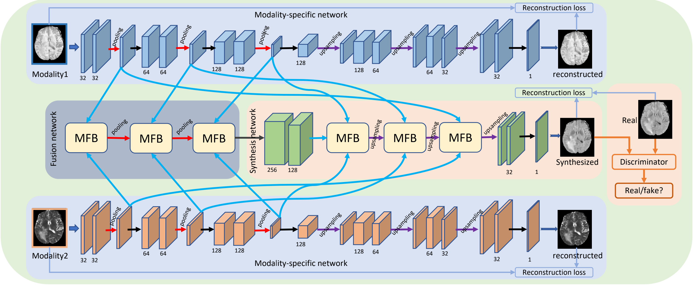

# Hi-Net

Code for TMI 2020 "Hi-Net: Hybrid-fusion Network for Multi-modal MR Image Synthesis"

----------------
Usage

1. The original implementation of Hi-Net is Pytorch. The code has been tested in Mac and Linux.
2. To run the code, you should first install dependencies:

   pip install fire
        
3. Setup all parameters in config.py

4. Put your data into ./data (Some samples from BraTs2018 have been stored out in this file)

5. Train
   
   CUDA_VISIBLE_DEVICES=0,1 python main.py train --batch_size=16 --task_id=2 --gpu_id=[0,1]
   
   
   (you can set your parameters when runing the code)
   

----------------

If you use this code, please cite the following papers:

[1] Tao Zhou, Huazhu Fu, Geng Chen, Jianbing Shen, Ling Shao. "Hi-Net: Hybrid-fusion Network for Multi-modal MR Image Synthesis". IEEE Transactions on Medical Imaging (IEEE TMI), 2020. ([Offical version](https://ieeexplore.ieee.org/abstract/document/9004544))([arXiv version](https://arxiv.org/pdf/2002.05000.pdf))

----------------
Datsets: you can download multi-modal medical datastes from:

[1] BraTs 2018: [[HERE]](https://www.med.upenn.edu/sbia/brats2018/data.html)

[2] BraTs 2019: [[HERE]](https://www.med.upenn.edu/cbica/brats2019/data.html)

[3] ISLES2015: [[HERE]](http://www.isles-challenge.org/ISLES2015/)

